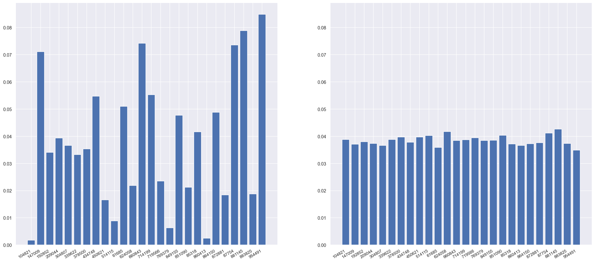
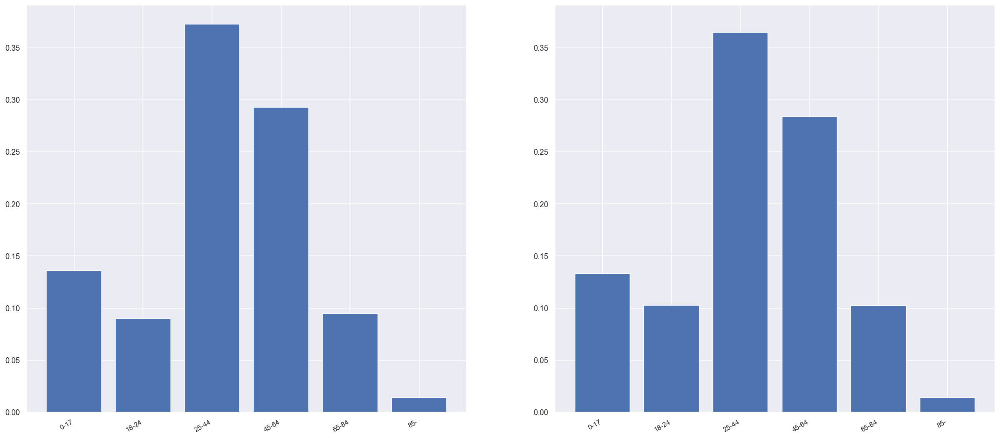
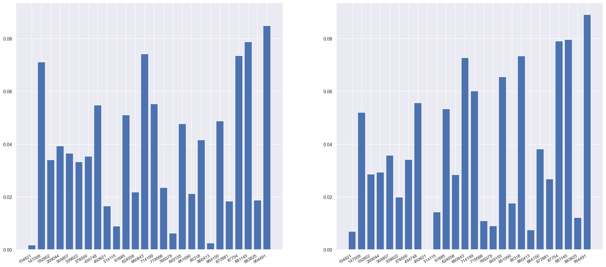
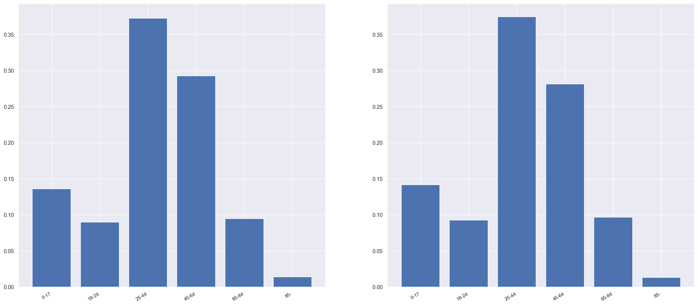

# Anonymisation with Synthetic Data Tutorial

## Some questions

**What is this?**

A hands-on tutorial showing how to use Python to create synthetic data.

**Wait, what is this "synthetic data" you speak of?**

It's data that is created by an automated process which contains many of the statistical patterns of an original dataset. It is also sometimes used as a way to release data that has no personal information in it, even if the original did contain lots of data that could identify people. This means programmers and data scientists can crack on with building software and algorithms that they know will work similarly on the real data.

**Who is this tutorial for?**

For any person who programs who wants to learn about data anonymisation in general or more specifically about synthetic data.

**What is it not for?**

Non-programmers. Although we think this tutorial is still worth a browse to get some of the main ideas in what goes in to anonymising a dataset. However, if you're looking for info on how to create synthetic data using the latest and greatest deep learning techniques, this is not the tutorial for you.

**Who are you?**

We're the Open Data Institute. We work with companies and governments to build an open, trustworthy data ecosystem. Anonymisation and synthetic data are some of the many, many ways we can responsibly increase access to data. If you want to learn more, [check out our site](http://theodi.org).

**Why did you make this?**

We have an [R&D program](https://theodi.org/project/data-innovation-for-uk-research-and-development/) that has a number of projects looking in to how to support innovation, improve data infrastructure and encourage ethical data sharing. One of our projects is about [managing the risks of re-identification](https://theodi.org/project/rd-broaden-access-to-personal-data-while-protecting-privacy-and-creating-a-fair-market/) in shared and open data. As you can see in the *Key outputs* section, we have other material from the project, but we thought it'd be good to have something specifically aimed at programmers who are interested in learning by doing.

**Speaking of which, can I just get to the tutorial now?**

Sure! Let's go.

## Overview

In this tutorial you are aiming to create a safe version of accident and emergency (A&E) admissions data, collected from multiple hospitals. This data contains some sensitive personal information about people's health and can't be openly shared. By removing and altering certain identifying information in the data we can greatly reduce the risk that patients can be re-identified and therefore hope to release the data.

Just to be clear, we're not using actual A&E data but are creating our own simple, mock, version of it.

The practical steps involve:

1. Create an A&E admissions dataset which will contain (pretend) personal information.
2. Run some anonymisation steps over this dataset to generate a new dataset with much less re-identification risk.
3. Take this de-identified dataset and generate multiple synthetic datasets from it to reduce the re-identification risk even further.
4. Analyse the synthetic datasets to see how similar they are to the original data.

You may be wondering, why can't we just do synthetic data step? If it's synthetic surely it won't contain any personal information?

Not exactly. Patterns picked up in the original data can be transferred to the synthetic data. This is especially true for outliers. For instance if there is only one person from an certain area over 85 and this shows up in the synthetic data, we would be able to re-identify them.

## Credit to others

This tutorial is inspired by the [NHS England and ODI Leeds' research](https://odileeds.org/events/synae/) in creating a synthetic dataset from NHS England's accident and emergency admissions. Please do read about their project, as it's really interesting and great for learning about the benefits and risks in creating synthetic data.

Also, the synthetic data generating library we use is [DataSynthetizer](https://homes.cs.washington.edu/~billhowe//projects/2017/07/20/Data-Synthesizer.html) and comes as part of this codebase. Coming from researchers in Drexel University and University of Washington, it's an excellent piece of software and their research and papers are well worth checking out. It's available as a [repo on Github](https://github.com/DataResponsibly/DataSynthesizer) which includes some short tutorials on how to use the toolkit and an accompanying research paper describing the theory behind it.

---

## Setup

First, make sure you have [Python3 installed](https://www.python.org/downloads/). Minimum Python 3.6.

Download this repository either as a zip or clone using Git.

Install required dependent libraries. You can do that, for example, with a _virtualenv_.

```bash
cd /path/to/repo/synthetic_data_tutorial/
pip install -r requirements.txt
```

Next we'll go through how to create, de-identify and synthesise the code. We'll show this using code snippets but the full code is contained within the `/tutorial` directory.

There's small differences between the code presented here and what's in the Python scripts but it's mostly down to variable naming. I'd encourage you to run, edit and play with the code locally.

## Generate mock NHS A&E dataset

The data already exists in `data/nhs_ae_mock.csv` so feel free to browse that. But you should generate your own fresh dataset using the `tutorial/generate.py` script.

To do this, you'll need to download one dataset first. It's a list of all postcodes in London. You can find it at this page on [doogal.co.uk](https://www.doogal.co.uk/PostcodeDownloads.php), at the _London_ link under the _By English region_ section. Or just download it directly at [this link](https://www.doogal.co.uk/UKPostcodesCSV.ashx?region=E12000007) (just take note, it's 133MB in size), then place the `London postcodes.csv` file in to the `data/` directory.

Or you can just do it using `curl`.

```bash
curl -o "./data/London postcodes.csv" https://www.doogal.co.uk/UKPostcodesCSV.ashx?region=E12000007
```

Then, to generate the data, from the project root directory run the `generate.py` script.

```bash
python tutorial/generate.py
```

Voila! You'll now see a new `hospital_ae_data.csv` file in the `/data` directory. Open it up and have a browse. It's contains the following columns:

- **Health Service ID**: NHS number of the admitted patient  
- **Age**: age of patient
- **Time in A&E (mins)**: time in minutes of how long the patient spent in A&E. This is generated to correlate with the age of the patient.
- **Hospital**: which hospital admitted the patient - with some hospitals being more prevalent in the data than others
- **Arrival Time**: what time and date the patient was admitted - with weekends as busier and and a different peak time for each day
- **Treatment**: what the person was treated for - with certain treatments being more common than others
- **Gender**: patient gender - based on [NHS patient gender codes](https://www.datadictionary.nhs.uk/data_dictionary/attributes/p/person/person_gender_code_de.asp?shownav=1)
- **Postcode**: postcode of patient - random, in use, London postcodes extracted from the `London postcodes.csv` file.

We can see this dataset obviously contains some personal information. For instance, if we knew roughly the time a neighbour went to A&E we could use their postcode to figure out exactly what ailment they went in with. Or, if a list of people's Health Service ID's were to be leaked in future, lots of people could be re-identified.

Because of this, we'll need to take some de-identification steps.

---

## De-identification

For this stage, we're going to be loosely following the de-identification techniques used by Jonathan Pearson of NHS England, and described in a blog post about [creating its own synthetic data](https://odileeds.org/blog/2019-01-24-exploring-methods-for-creating-synthetic-a-e-data).

If you look in `tutorial/deidentify.py` you'll see the full code of all de-identification steps. You can run this code easily.

```bash
python tutorial/deidentify.py
```

It takes the `data/hospital_ae_data.csv` file, run the steps, and saves the new dataset to `data/hospital_ae_data_deidentify.csv`.

Breaking down each of these steps. It first loads the `data/nhs_ae_data.csv` file in to the Pandas DataFrame as `hospital_ae_df`.

```python
# _df is a common way to refer to a Pandas DataFrame object
hospital_ae_df = pd.read_csv(filepaths.hospital_ae_data)
```

(`filepaths.py` is, surprise, surprise, where all the filepaths are listed)

### Remove Health Service ID numbers

Health Service ID numbers are direct identifiers and should be removed. So we'll simply drop the entire column.

```python
hospital_ae_df = hospital_ae_df.drop('Health Service ID', 1)
```

### Where a patient lives

Pseudo-identifiers, also known as [quasi-identifiers](https://en.wikipedia.org/wiki/Quasi-identifier), are pieces of information that don't directly identify people but can used with other information to identify a person. If we were to take the age, postcode and gender of a person we could combine these and check the dataset to see what that person was treated for in A&E.

The data scientist from NHS England, Jonathan Pearson, describes this in the blog post:

> I started with the postcode of the patients resident lower super output area (LSOA). This is a geographical definition with an average of 1500 residents created to make reporting in England and Wales easier. I wanted to keep some basic information about the area where the patient lives whilst completely removing any information regarding any actual postcode. A key variable in health care inequalities is the patients Index of Multiple deprivation (IMD) decile (broad measure of relative deprivation) which gives an average ranked value for each LSOA. By replacing the patients resident postcode with an IMD decile I have kept a key bit of information whilst making this field non-identifiable.

We'll do just the same with our dataset.

First we'll map the rows' postcodes to their LSOA and then drop the postcodes column.

```python
postcodes_df = pd.read_csv(filepaths.postcodes_london)
hospital_ae_df = pd.merge(
    hospital_ae_df,
    postcodes_df[['Postcode', 'Lower layer super output area']],
    on='Postcode'
)
hospital_ae_df = hospital_ae_df.drop('Postcode', 1)
```

Then we'll add a mapped column of "Index of Multiple Deprivation" column for each entry's LSOA.

```python
hospital_ae_df = pd.merge(
    hospital_ae_df,
    postcodes_df[['Lower layer super output area', 'Index of Multiple Deprivation']].drop_duplicates(),
    on='Lower layer super output area'
)
```

Next calculate the decile bins for the IMDs by taking all the IMDs from large list of London. We'll use the Pandas `qcut` (quantile cut), function for this.

```python
_, bins = pd.qcut(
    postcodes_df['Index of Multiple Deprivation'],
    10,
    retbins=True,
    labels=False
)
```

Then we'll use those decile `bins` to map each row's IMD to its IMD decile.

```python
# add +1 to get deciles from 1 to 10 (not 0 to 9)
hospital_ae_df['Index of Multiple Deprivation Decile'] = pd.cut(
    hospital_ae_df['Index of Multiple Deprivation'],
    bins=bins,
    labels=False,
    include_lowest=True) + 1
```

And finally drop the columns we no longer need.

```python
hospital_ae_df = hospital_ae_df.drop('Index of Multiple Deprivation', 1)
hospital_ae_df = hospital_ae_df.drop('Lower layer super output area', 1)
```

### Individual hospitals

The data scientist at NHS England masked individual hospitals giving the following reason.

> As each hospital has its own complex case mix and health system, using these data to identify poor performance or possible improvements would be invalid and un-helpful. Therefore, I decided to replace the hospital code with a random number.

So we'll do as they did, replacing hospitals with a random six-digit ID.

```python
hospitals = hospital_ae_df['Hospital'].unique().tolist()
random.shuffle(hospitals)
hospitals_map = {
    hospital : ''.join(random.choices(string.digits, k=6))
    for hospital in hospitals
}
hospital_ae_df['Hospital ID'] = hospital_ae_df['Hospital'].map(hospitals_map)
```

And remove the `Hospital` column.

```python
hospital_ae_df = hospital_ae_df.drop('Hospital', 1)
```

### Time in the data

> The next obvious step was to simplify some of the time information I have available as health care system analysis doesn't need to be responsive enough to work on a second and minute basis. Thus, I removed the time information from the 'arrival date', mapped the 'arrival time' into 4-hour chunks

First we'll split the `Arrival Time` column in to `Arrival Date` and `Arrival Hour`.

```python
arrival_times = pd.to_datetime(hospital_ae_df['Arrival Time'])
hospital_ae_df['Arrival Date'] = arrival_times.dt.strftime('%Y-%m-%d')
hospital_ae_df['Arrival Hour'] = arrival_times.dt.hour
hospital_ae_df = hospital_ae_df.drop('Arrival Time', 1)
```

Then we'll map the hours to 4-hour chunks and drop the `Arrival Hour` column.

```python
hospital_ae_df['Arrival hour range'] = pd.cut(
    hospital_ae_df['Arrival Hour'],
    bins=[0, 4, 8, 12, 16, 20, 24],
    labels=['00-03', '04-07', '08-11', '12-15', '16-19', '20-23'],
    include_lowest=True
)
hospital_ae_df = hospital_ae_df.drop('Arrival Hour', 1)
```

### Patient demographics

> I decided to only include records with a sex of male or female in order to reduce risk of re identification through low numbers.

```python
hospital_ae_df = hospital_ae_df[hospital_ae_df['Gender'].isin(['Male', 'Female'])]
```

> For the patients age it is common practice to group these into bands and so I've used a standard set - 1-17, 18-24, 25-44, 45-64, 65-84, and 85+ - which although are non-uniform are well used segments defining different average health care usage.

```python
hospital_ae_df['Age bracket'] = pd.cut(
    hospital_ae_df['Age'],
    bins=[0, 18, 25, 45, 65, 85, 150],
    labels=['0-17', '18-24', '25-44', '45-64', '65-84', '85-'],
    include_lowest=True
)
hospital_ae_df = hospital_ae_df.drop('Age', 1)
```

That's all the steps we'll take. We'll finally save our new de-identified dataset.

```python
hospital_ae_df.to_csv(filepaths.hospital_ae_data_deidentify, index=False)
```

---

## Synthesise

Synthetic data exists on a spectrum from merely the same columns and datatypes as the original data all the way to carrying nearly all of the statistical patterns of the original dataset.

The UK's Office of National Statistics has a great report on synthetic data and the [_Synthetic Data Spectrum_](https://www.ons.gov.uk/methodology/methodologicalpublications/generalmethodology/onsworkingpaperseries/onsmethodologyworkingpaperseriesnumber16syntheticdatapilot?utm_campaign=201903_UK_DataPolicyNetwork&utm_source=hs_email&utm_medium=email&utm_content=70377606&_hsenc=p2ANqtz-9W6ByBext_HsgkTPG1lw2JJ_utRoJSTIeVC5Z2lz3QkzwFQpZ0dp2ns9SZLPqxLJrgWzsjC_zt7FQcBvtIGoeSjZtwNg&_hsmi=70377606#synthetic-dataset-spectrum) section is very good in explaining the nuances in more detail.

In this tutorial we'll create not one, not two, but *three* synthetic datasets, that are on a range across the synthetic data spectrum: *Random*, *Independent* and *Correlated*.

> In **correlated attribute mode**, we learn a differentially private Bayesian network capturing the correlation structure between attributes, then draw samples from this model to construct the result dataset.
>
> In cases where the correlated attribute mode is too computationally expensive or when there is insufficient data to derive a reasonable model, one can use **independent attribute mode**. In this mode, a histogram is derived for each attribute, noise is added to the histogram to achieve differential privacy, and then samples are drawn for each attribute.
>
> Finally, for cases of extremely sensitive data, one can use **random mode** that simply generates type-consistent random values for each attribute.

We'll go through each of these now, moving along the synthetic data spectrum, in the order of random to independent to correlated.

The toolkit we will be using to generate the three synthetic datasets is DataSynthetizer.

### DataSynthesizer

As described in the introduction, this is an open-source toolkit for generating synthetic data. And I'd like to lavish much praise on the researchers who made it as it's excellent.

Instead of explaining it myself, I'll use the researchers' own words from their paper:

> DataSynthesizer infers the domain of each attribute and derives a description of the distribution of attribute values in the private dataset. This information is saved in a dataset description file, to which we refer as data summary. Then DataSynthesizer is able to generate synthetic datasets of arbitrary size by sampling from the probabilistic model in the dataset description file.

We'll create and inspect our synthetic datasets using three modules within it.

> DataSynthesizer consists of three high-level modules:
>
> 1. **DataDescriber**: investigates the data types, correlations and distributions of the attributes in the private dataset, and produces a data summary.
> 2. **DataGenerator**: samples from the summary computed by DataDescriber and outputs synthetic data
> 3. **ModelInspector**: shows an intuitive description of the data summary that was computed by DataDescriber, allowing the data owner to evaluate the accuracy of the summarization process and adjust any parameters, if desired.

If you want to browse the code for each of these modules, you can find the Python classes for in the `DataSynthetizer` directory (all code in here from the [original repo](https://github.com/DataResponsibly/DataSynthesizer)).


### An aside about differential privacy and Bayesian networks

You might have seen the phrase "differentially private Bayesian network" in the *correlated mode* description earlier, and got slightly panicked. But fear not! You don't need to worry *too* much about these to get DataSynthesizer working.

First off, while DataSynthesizer has the option of using differential privacy for anonymisation, we are turning it off and won't be using it in this tutorial. So you can ignore that part. However, if you care about anonymisation you really should read up on differential privacy. I've read a lot of explainers on it and the best I found was [this article from Access Now](https://www.accessnow.org/understanding-differential-privacy-matters-digital-rights/).

Now the next term, Bayesian networks. These are graphs with directions which model the statistical relationship between a dataset's variables. It does this by saying certain variables are "parents" of others, that is, their value influences their "children" variables. Parent variables can influence children but children can't influence parents. In our case, if patient age is a parent of waiting time, it means the age of patient influences how long they wait, but how long they doesn't influence their age. So by using Bayesian Networks, DataSynthesizer can model these influences and use this model in generating the synthetic data.

It can be a slightly tricky topic to grasp but a nice, introductory tutorial on them is at the [Probabilistic World site](https://www.probabilisticworld.com/bayesian-belief-networks-part-1/). Give it a read.

### Random mode

If we were just to generate A&E data for testing our software, we wouldn't care too much about the statistical patterns within the data. Just that it was roughly a similar size and that the datatypes and columns aligned.

In this case, we can just generate the data at random using the `generate_dataset_in_random_mode` function within the `DataGenerator` class.

#### Data Description: Random

The first step is to create a description of the data, defining the datatypes and which are the categorical variables.

```python
attribute_to_datatype = {
    'Time in A&E (mins)': 'Integer',
    'Treatment': 'String',
    'Gender': 'String',
    'Index of Multiple Deprivation Decile': 'Integer',
    'Hospital ID': 'String',
    'Arrival Date': 'String',
    'Arrival hour range': 'String',  
    'Age bracket': 'String'
}

attribute_is_categorical = {
    'Hospital ID': True,
    'Time in A&E (mins)': False,
    'Treatment': True,
    'Gender': True,
    'Index of Multiple Deprivation Decile': False,
    'Arrival Date': True,
    'Arrival hour range': True,  
    'Age bracket': True
}
```

We'll be feeding these in to a `DataDescriber` instance.

```python
describer = DataDescriber()
```

Using this `describer` instance, feeding in the attribute descriptions, we create a description file.

```python
describer.describe_dataset_in_random_mode(
    filepaths.hospital_ae_data_deidentify,
    attribute_to_datatype=attribute_to_datatype,
    attribute_to_is_categorical=attribute_is_categorical)
describer.save_dataset_description_to_file(
    filepaths.hospital_ae_description_random)
```

You can see an example description file in `data/hospital_ae_description_random.json`.

#### Data Generation: Random

Next, generate the random data. We'll just generate the same amount of rows as was in the original data but, importantly, we could generate much more or less if we wanted to.

```python
num_rows = len(hospital_ae_df)
```

Now generate the random data.

```python
generator = DataGenerator()
generator.generate_dataset_in_random_mode(
    num_rows, filepaths.hospital_ae_description_random)
generator.save_synthetic_data(filepaths.hospital_ae_data_synthetic_random)
```

You can view this random synthetic data in the file `data/hospital_ae_data_synthetic_random.csv`.

#### Attribute Comparison: Random

We'll compare each attribute in the original data to the synthetic data by generating plots of histograms using the `ModelInspector` class.

`figure_filepath` is just a variable holding where we'll write the plot out to.

```python
synthetic_df = pd.read_csv(filepaths.hospital_ae_data_synthetic_random)

# Read attribute description from the dataset description file.
attribute_description = read_json_file(
    filepaths.hospital_ae_description_random)['attribute_description']

inspector = ModelInspector(hospital_ae_df, synthetic_df, attribute_description)

for attribute in synthetic_df.columns:
    inspector.compare_histograms(attribute, figure_filepath)
```

Let's look at the histogram plots now for a few of the attributes. We can see that the generated data is completely random and doesn't contain any information about averages or distributions.

*Comparison of ages in original data (left) and random synthetic data (right)*


*Comparison of hospital attendance in original data (left) and random synthetic data (right)*


*Comparison of arrival date in original data (left) and random synthetic data (right)*


You can see more comparison examples in the `/plots` directory.

#### Compare pairwise mutual information: Random

DataSynthesizer has a function to compare the _mutual information_ between each of the variables in the dataset and plot them. We'll avoid the mathematical definition of mutual information but [Scholarpedia notes](http://www.scholarpedia.org/article/Mutual_information) it:

> can be thought of as the reduction in uncertainty about one random variable given knowledge of another.

To create this plot we run.

```python
synthetic_df = pd.read_csv(filepaths.hospital_ae_data_synthetic_random)

inspector = ModelInspector(hospital_ae_df, synthetic_df, attribute_description)
inspector.mutual_information_heatmap(figure_filepath)
```

We can see the original, private data has a correlation between `Age bracket` and `Time in A&E (mins)`. Not surprisingly, this correlation is lost when we generate our random data.

*Mutual Information Heatmap in original data (left) and random synthetic data (right)*


### Independent attribute mode

What if we had the use case where we wanted to build models to analyse the medians of ages, or hospital usage in the synthetic data? In this case we'd use independent attribute mode.

#### Data Description: Independent

```python
describer.describe_dataset_in_independent_attribute_mode(
    attribute_to_datatype=attribute_to_datatype,
    attribute_to_is_categorical=attribute_is_categorical)
describer.save_dataset_description_to_file(
    filepaths.hospital_ae_description_independent)
```

#### Data Generation: Independent

Next generate the data which keep the distributions of each column but not the data correlations.

```python
generator = DataGenerator()
generator.generate_dataset_in_independent_mode(
    num_rows, filepaths.hospital_ae_description_independent)
generator.save_synthetic_data(
    filepaths.hospital_ae_data_synthetic_independent)
```

#### Attribute Comparison: Independent

Comparing the attribute histograms we see the independent mode captures the distributions pretty accurately. You can see the synthetic data is _mostly_ similar but not exactly.

```python
synthetic_df = pd.read_csv(filepaths.hospital_ae_data_synthetic_independent)
attribute_description = read_json_file(
    filepaths.hospital_ae_description_random)['attribute_description']
inspector = ModelInspector(hospital_ae_df, synthetic_df, attribute_description)

for attribute in synthetic_df.columns:
    inspector.compare_histograms(attribute, figure_filepath)
```

*Comparison of ages in original data (left) and independent synthetic data (right)*


*Comparison of hospital attendance in original data (left) and independent synthetic data (right)*


*Comparison of arrival date in original data (left) and independent synthetic data (right)*


#### Compare pairwise mutual information: Independent

```python
synthetic_df = pd.read_csv(filepaths.hospital_ae_data_synthetic_independent)

inspector = ModelInspector(hospital_ae_df, synthetic_df, attribute_description)
inspector.mutual_information_heatmap(figure_filepath)
```

We can see the independent data also does not contain any of the attribute correlations from the original data.

*Mutual Information Heatmap in original data (left) and independent synthetic data (right)*


### Correlated attribute mode - include correlations between columns in the data

If we want to capture correlated variables, for instance if patient is related to waiting times, we'll need correlated data. To do this we use *correlated mode*.

#### Data Description: Correlated

There's a couple of parameters that are different here so we'll explain them.

`epsilon` is a value for DataSynthesizer's differential privacy which says the amount of noise to add to the data - the higher the value, the more noise and therefore more privacy. We're not using differential privacy so we can set it to zero.

`k` is the maximum number of parents in a Bayesian network, i.e., the maximum number of incoming edges. For simplicity's sake, we're going to set this to 1, saying that for a variable only one other variable can influence it.

```python
describer.describe_dataset_in_correlated_attribute_mode(
    dataset_file=filepaths.hospital_ae_data_deidentify,
    epsilon=0,
    k=1,
    attribute_to_datatype=attribute_to_datatype,
    attribute_to_is_categorical=attribute_is_categorical)

describer.save_dataset_description_to_file(filepaths.hospital_ae_description_correlated)
```

#### Data Generation: Correlated

```python
generator.generate_dataset_in_correlated_attribute_mode(
    num_rows, filepaths.hospital_ae_description_correlated)
generator.save_synthetic_data(filepaths.hospital_ae_data_synthetic_correlated)
```

#### Attribute Comparison: Correlated

We can see correlated mode keeps similar distributions also. It looks the exact same but if you look closely there are also small differences in the distributions.

*Comparison of ages in original data (left) and correlated synthetic data (right)*


*Comparison of hospital attendance in original data (left) and independent synthetic data (right)*


*Comparison of arrival date in original data (left) and independent synthetic data (right)*


#### Compare pairwise mutual information: Correlated

Finally, we see in correlated mode, we manage to capture the correlation between `Age bracket` and `Time in A&E (mins)`.

```python
synthetic_df = pd.read_csv(filepaths.hospital_ae_data_synthetic_correlated)

inspector = ModelInspector(hospital_ae_df, synthetic_df, attribute_description)
inspector.mutual_information_heatmap(figure_filepath)
```

*Mutual Information Heatmap in original data (left) and correlated synthetic data (right)*


---

### Wrap-up

This is where our tutorial ends. But there is much, much more to the world of anonymisation and synthetic data. Please check out more in the references below.

If you have any queries, comments or improvements about this tutorial please do get in touch. You can send me a message through Github or leave an Issue.

### References

- [Exploring methods for synthetic A&E data](https://odileeds.org/blog/2019-01-24-exploring-methods-for-creating-synthetic-a-e-data) - Jonathan Pearson, NHS England with Open Data Institute Leeds.
- [DataSynthesizer Github Repository](https://github.com/DataResponsibly/DataSynthesizer)
- [DataSynthesizer: Privacy-Preserving Synthetic Datasets](https://faculty.washington.edu/billhowe/publications/pdfs/ping17datasynthesizer.pdf) Haoyue Ping, Julia Stoyanovich, and Bill Howe. 2017
- [ONS methodology working paper series number 16 - Synthetic data pilot](https://www.ons.gov.uk/methodology/methodologicalpublications/generalmethodology/onsworkingpaperseries/onsmethodologyworkingpaperseriesnumber16syntheticdatapilot) - Office of National Statistics, 2019.
- [Wrap-up blog post](http://theodi.org) (not yet published) from our anonymisation project which talks about what we learned and other outputs we created.
- We referred to the [UK Anonymisation Network's Decision Making Framework](https://ukanon.net/ukan-resources/ukan-decision-making-framework/) a lot during our work. It's pretty involved but it's excellent as a deep-dive resource on anonymisation.
